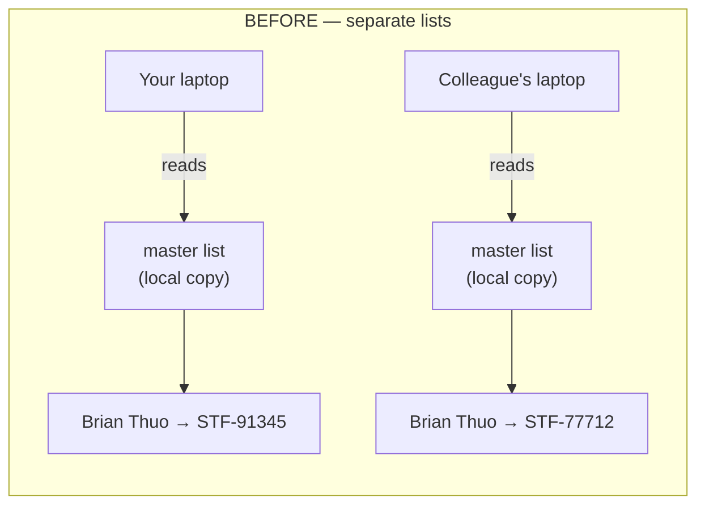
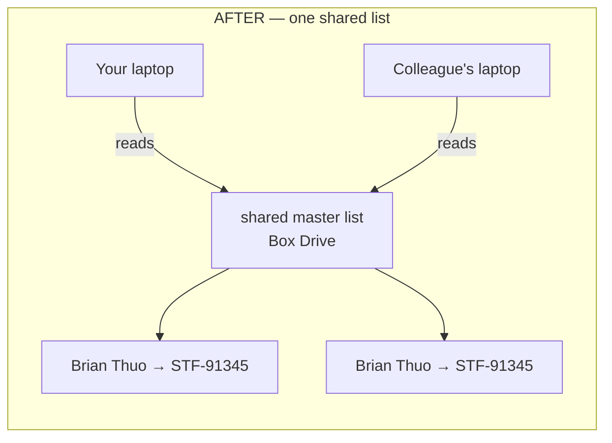
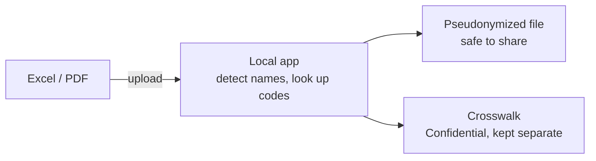

# One Name, One Code — System Architecture

A non-technical view of how a pseudonym code stays attached to the same
person or organization across every file and every teammate. For the full
engineering architecture (clean-architecture layers, ports, adapters), see
`CLAUDE.md`.

## The question

You upload a NetSuite export today. A colleague uploads an unrelated PDF next
week. Both contain `Brian Thuo`. Do they get the same code?

That depends on one thing: whether the two uploads are checking the same
master list.

## The mechanism

Moving the master list from each laptop to one shared, access-controlled Box
folder is the entire mechanism — nothing about detection changed, only
*where the answer key lives*.

Each teammate's copy of the tool now points at that one shared folder (a
one-time setup step — the tool prompts for it on first launch, via
`run.bat`'s master-list-location wizard). Edit permissions stay narrow: one
owner or a small group maintains the list directly, and Box's own version
history covers the audit trail (see `data/README.md`).

Names that *aren't* on the list yet are unaffected by any of this — they
already get a consistent, automatically generated code from the name itself,
identically on every machine, with nothing to configure.

## What happens to one file

The crosswalk (the code&rarr;name key) never travels with the pseudonymized
file — it's downloaded separately, only when needed, and handled under IPA's
Confidential data classification.

## Local, shared, and never-shared

||What|Why it's there|
|-|-|-|
|**Runs locally**|The app and your uploaded file|Detection and pseudonymization happen entirely on your own computer; nothing is uploaded except the pseudonymized copy you choose to download.|
|**Shared, access-controlled**|The master list|One workbook, one Box folder, read by every teammate's install — this is what makes a code portable across people, not just across your own files.|
|**Never distributed**|The crosswalk|The code&rarr;real-name key. Downloaded only when needed, stored separately from the pseudonymized output, never shared alongside it.|

## Related docs

- `CLAUDE.md` — full engineering architecture (clean-architecture layers,
  ports/adapters, caching).
- `data/README.md` — master-list format, and the "Sharing one master list
  across a team" setup steps this diagram summarizes.
- `docs/GOTCHA.md` — troubleshooting for the shared-list setup and the
  `run.bat` wizard.
